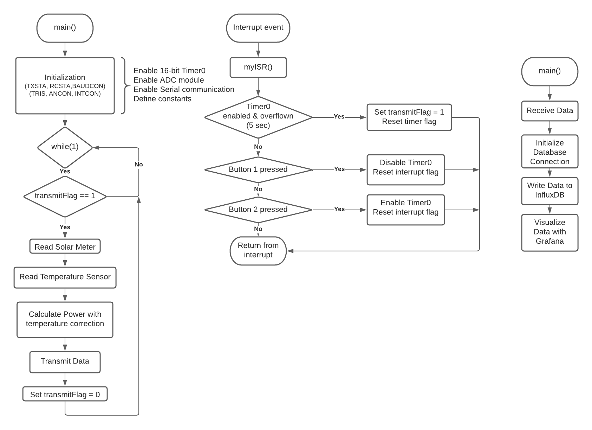

# Solar Irradiance Meter

For this assignment we were asked to create a solar irradiance meter by means of a small 5W
PV panel and an embedded device based on the PIC18F25k80 microcontroller. The purpose of the
meter is to test the efficiency of bigger solar panels, by comparing their power output to the meter’s.
The meter works by measuring the power of the sunlight at a given point in time and applies
temperature correction for the final power calculation. From that value we can estimate the power that
the main panels should be outputting, and if they aren't then there might be a problem with them.

